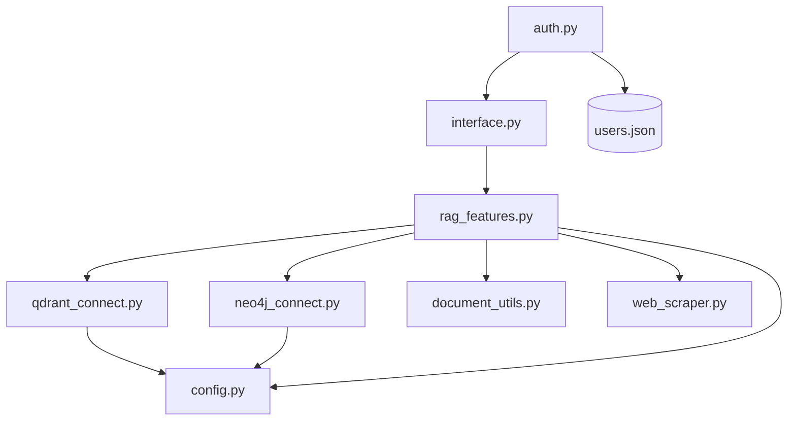

# BluePrint: Architecture GreenPower RAG

Ce document sert de référence technique pour la maintenance, l'extension et la compréhension du code actuel. Il définit les responsabilités de chaque module et impose des contraintes pour les développements futurs.

**Dernière mise à jour**: 2026-01-22

## 1. Architecture Globale

Le projet suit une architecture **modulaire** où chaque fichier a une responsabilité unique.



## 2. Statut des Services

| Service | Mode de Connexion | Notes |
|---------|-------------------|-------|
| **Qdrant Cloud** | REST API (port 443) | gRPC désactivé pour compatibilité firewall/proxy |
| **Neo4J Aura** | HTTP API (fallback) | Driver Bolt en premier, fallback HTTP si bloqué |
| **LlamaParse** | API Cloud | Fallback vers PyPDFLoader si échec |
| **Groq LLM** | API Cloud | Modèle configurable via `.env` |

## 3. Spécifications Technique des Modules

Cette section détaille les fonctions clés, en particulier celles dont la logique interne est complexe ou non-immédiate.

### 🔐 `auth.py` (Authentification)
Gère l'authentification des utilisateurs avec stockage local JSON.

*   **Stockage**: `users.json` (créé automatiquement avec compte admin par défaut)
*   **Sécurité**: Mots de passe hashés en SHA-256
*   **Compte par défaut**: `admin` / `admin123`

*   `authenticate(username, password)`:
    *   Vérifie les credentials et retourne les infos utilisateur si valides.
    
*   `require_auth(st)`:
    *   **Helper Streamlit**: Vérifie si l'utilisateur est connecté.
    *   Si non connecté, affiche la page de login et retourne `False`.
    *   Utilisation: `if not require_auth(st): st.stop()`

*   `create_user(username, password, role, display_name)`:
    *   Crée un nouvel utilisateur (roles: `admin` ou `user`).

*   `change_password(username, old_password, new_password)`:
    *   Change le mot de passe d'un utilisateur.

### 🧠 `rag_features.py` (Cerveau du système)
Gère la logique de RAG Hybride et le routage des questions.

*   `HybridRetriever.__init__(use_neo4j=False)`:
    *   Initialise les connexions.
    *   **Contrainte**: Si `use_neo4j=True`, la classe tente d'initialiser `GraphRAG`. Si la connexion échoue, elle doit gérer l'erreur silencieusement ou passer en mode dégradé, mais ne pas crasher l'app.
    
*   `route_query(query: str) -> str`:
    *   **Logique**: Analyse la question par mots-clés (Regex) pour décider de la stratégie : `'qdrant'` (factuel/prix), `'neo4j'` (relationnel/historique) ou `'hybrid'` (tout le reste).
    *   **Pourquoi**: Évite d'interroger le graphe (couteux) pour des questions simples comme "Quel est le prix ?".

*   `retrieve(query: str) -> Tuple`:
    *   Dispatche la requête vers les connecteurs appropriés selon le résultat de `route_query`.
    *   Retourne une liste de "chunks" (documents vectoriels + contexte graphe simulé en document).
    *   **Métriques**: Enregistre les temps de latence Qdrant et Neo4J séparément.

*   `ingest(file_paths: List[str]) -> dict`:
    *   **Logging amélioré**: Affiche le nombre de documents chargés, chunks créés, et points indexés.
    *   **Neo4J activé par défaut**: Crée automatiquement les entités et relations dans le graphe.
    *   Retourne un dictionnaire avec `vector_chunks`, `graph_entities`, `graph_relations`.

*   `contextualize_query(query: str, chat_history: List[dict]) -> str`:
    *   **Mémoire conversationnelle**: Reformule les questions pour les rendre autonomes.
    *   Résout les pronoms (it, this, sa, son, ce, cette, etc.)
    *   Utilise les 6 derniers messages de l'historique.
    *   **Optimisation**: Ne reformule que si nécessaire (détecte les pronoms ou questions courtes).
    *   Exemple: "Et sa garantie ?" → "Quelle est la garantie de SolarMax 500 ?"

### 🕸️ `neo4j_connect.py` (Graphe de Connaissances)
Gère l'interaction avec Neo4j et l'extraction d'entités via LLM.

*   `Neo4jConnection._connect()`:
    *   **Double mode de connexion**:
        1. Tente d'abord le driver Bolt (`neo4j+s://`)
        2. Si échec (firewall/proxy), fallback vers l'API HTTP (`https://`)
    *   **Détection automatique**: La classe détecte quel mode est actif via `use_http_api`.

*   `Neo4jConnection.execute_query(query, parameters)`:
    *   Supporte les deux modes de connexion (Bolt et HTTP API).
    *   L'API HTTP utilise une substitution simple des paramètres.

*   `GraphRAG.extract_entities_and_relations(text: str)`:
    *   Utilise un **Prompt LLM** spécialisé pour transformer du texte brut en JSON structuré.
    *   **Contrainte**: Doit toujours nettoyer la sortie du LLM (suppression des balises markdown ```json) avant le parsing.
    
*   `GraphRAG.build_graph(documents)`:
    *   Itère sur les documents, extrait les entités pour chacun, et les insère dans Neo4j.
    *   **Attention**: Maintient une map `entity_id_map` locale pour éviter les duplications *pendant l'exécution*, mais ne vérifie pas encore l'existence en base au démarrage (risque de doublons si relancé plusieurs fois sans nettoyage).

*   `GraphRAG.query_graph(question)`:
    *   **Non-vectoriel**: N'utilise pas d'embeddings de graphe.
    *   **Logique**: Extrait les mots-clés de la question -> Trouve les nœuds correspondants (index fulltext ou contains) -> Récupère les voisins immédiats (profondeur 1).
    *   Retourne une représentation textuelle du sous-graphe trouvé.

### 🌐 `web_scraper.py` (Web Scraping)
Module de scraping web pour enrichir automatiquement la base RAG.

*   `WebScraper`:
    *   **Headers**: Simule un navigateur Chrome pour éviter les blocages.
    *   **Politesse**: Délai configurable entre les requêtes (par défaut 1s).
    *   **Extraction**:
        - Titre de la page (balise `<title>` ou `<h1>`)
        - Texte propre (suppression des scripts, styles, nav, footer)
        - Images avec leurs attributs alt/title
        - Liens internes pour le suivi optionnel

*   `WebToDocuments.scrape_and_convert()`:
    *   Convertit les pages scrapées en `Document` LangChain.
    *   Crée des documents séparés pour les descriptions d'images (si alt text présent).
    *   **Métadonnées**: `source`, `title`, `type`, `scraped_at`, `image_count`, `link_count`.

*   `scrape_urls_for_rag()`:
    *   **Fonction utilitaire** pour un usage simple.
    *   Paramètres:
        - `urls`: Liste des URLs à scraper
        - `follow_links`: Suivre les liens internes (False par défaut)
        - `max_pages`: Limite de pages (10 par défaut)
        - `include_images`: Inclure les métadonnées d'images (True par défaut)

### 💾 `qdrant_connect.py` (Base Vectorielle)
Wrapper pour Qdrant.

*   `_connect()`:
    *   **Connexion REST optimisée**: Utilise `host/port/https` au lieu de `url` pour meilleure compatibilité.
    *   **Paramètres clés**:
        ```python
        QdrantClient(
            host=host,          # Sans le préfixe https://
            port=443,           # Port HTTPS standard
            https=True,         # Connexion sécurisée
            prefer_grpc=False,  # Force REST mode (gRPC souvent bloqué)
            timeout=60
        )
        ```
    *   **Fallback**: Base locale (`:memory:`) si connexion cloud impossible.

### 📄 `document_utils.py` (ETL)
Chargeurs de fichiers.

*   `load_document(file_path)`:
    *   **Factory pattern avec fallback intelligent**:
        1. Pour les PDFs: Tente LlamaParse d'abord
        2. Si LlamaParse échoue OU retourne 0 documents -> PyPDFLoader
    *   **Logging complet**: Affiche chaque étape du chargement.
    *   **Contrainte**: Doit retourner une `List[Document]` compatible LangChain, quel que soit le format d'entrée.

### 📊 `interface.py` (UI Streamlit)
Interface utilisateur avec métriques.

*   **Metrics Dashboard**:
    *   Latence par route (qdrant/neo4j/hybrid)
    *   Comparaison Qdrant vs Neo4J
    *   Scatter plot Query Length vs Latency

*   **Format CSV métriques (`metrics.csv`)**:
    ```
    timestamp,latency,route,query_length,response_length,qdrant_latency,neo4j_latency
    ```

## 4. Configuration `.env`

```env
# Groq LLM
GROQ_API_KEY=gsk_xxx
GROQ_MODEL=openai/gpt-oss-120b

# Qdrant Cloud (REST mode)
QDRANT_URL=https://xxx.europe-west3-0.gcp.cloud.qdrant.io
QDRANT_API_KEY=eyJxxx

# Neo4j Aura (Bolt + HTTP fallback)
NEO4J_URI=neo4j+s://xxx.databases.neo4j.io
NEO4J_USER=neo4j
NEO4J_PASSWORD=xxx

# LlamaParse (optionnel - fallback PyPDF si absent/invalide)
LLAMA_CLOUD_API_KEY=xxx
```

## 5. Contraintes de Développement

Pour tout ajout de fonctionnalité, respectez ces règles :

1.  **Configuration Centralisée** :
    *   🚫 **Interdit** de mettre des `os.getenv()` ou des clés en dur dans les modules.
    *   ✅ Toujours importer depuis `config.py`.

2.  **Gestion des Erreurs Silencieuse** :
    *   Les connecteurs (`_connect()`) ne doivent pas lever d'exception bloquante. Ils doivent imprimer un warning (⚠️) et si possible fournir une instance de fallback (ex: Qdrant en mémoire, ou désactiver Neo4j).

3.  **Fallback Multi-Protocole** :
    *   ✅ Toujours prévoir un fallback si le protocole principal est bloqué (gRPC → REST, Bolt → HTTP).
    *   Les environnements réseau restrictifs (proxy, firewall) sont courants.

4.  **Typage** :
    *   Utiliser les type hints (`List`, `Dict`, `Optional`) pour toutes les signatures de fonction.

5.  **Dépendances** :
    *   Si un module a besoin d'une nouvelle librairie, l'ajouter immédiatement à `requirements.txt`.

6.  **Logging** :
    *   Utiliser des émojis pour les statuts : ✅ succès, ⚠️ warning, ❌ erreur, 📄 info
    *   Afficher les détails utiles (nombre de documents, temps, etc.)

## 6. Problèmes Connus et Solutions

| Problème | Cause | Solution |
|----------|-------|----------|
| Qdrant timeout avec `url=` | gRPC bloqué par firewall | Utiliser `host/port/https` + `prefer_grpc=False` |
| Neo4J "Unable to retrieve routing" | Bolt bloqué par firewall | Fallback HTTP API automatique |
| LlamaParse "Invalid token format" | API key invalide/expirée | Fallback automatique vers PyPDFLoader |
| metrics.csv parsing error | Header incomplet | S'assurer que le header a 7 colonnes |

## 7. Template de Nouveau Module

Utilisez ce script boilerplate pour créer un nouveau module "Service" (ex: `web_search.py`, `sql_connect.py`).

```python
# new_module_template.py
import logging
from typing import Dict, Any, Optional
from config import MY_NEW_API_KEY  # Toujours importer la config

# Configurer un logger spécifique au module
logger = logging.getLogger(__name__)

class MyServiceConnector:
    """
    Description claire du rôle de ce module.
    Ex: Gère la connexion à l'API de recherche Web.
    """
    
    def __init__(self):
        self.is_active = False
        self._connect()
        
    def _connect(self):
        """
        Logique de connexion sécurisée.
        Ne doit pas crasher l'app si le service est indisponible.
        """
        if not MY_NEW_API_KEY:
            logger.warning("⚠️ API Key manquante. Service désactivé.")
            return

        try:
            # Tenter la connexion ici
            # self.client = ...
            self.is_active = True
            print("✅ Service connecté")
        except Exception as e:
            logger.error(f"❌ Erreur de connexion: {e}")
            self.is_active = False

    def execute_task(self, input_data: str) -> Dict[str, Any]:
        """
        Fonction principale du module.
        Le nom doit être explicite (ex: search, fetch, compute).
        """
        if not self.is_active:
            return {"error": "Service inactive"}
            
        # Logique métier interne complexe/non-explicite
        # Expliciter ici ce que fait le traitement
        result = self._internal_processing(input_data)
        return result

    def _internal_processing(self, data: str) -> str:
        """
        Méthode privée pour la logique 'cuisine interne' qui n'a pas besoin
        d'être exposée.
        """
        return data.upper() # Placeholder
```

## 8. Roadmap / TODO

- [ ] **Support des images dans les PDFs** : Extraire les images, les analyser avec un modèle Vision, et indexer les descriptions
- [ ] **Vérification des doublons Neo4J** : Checker l'existence des entités avant insertion
- [ ] **Métriques avancées** : Ajouter le tracking des erreurs et du taux de succès
- [ ] **Tests unitaires** : Couvrir les modules critiques
